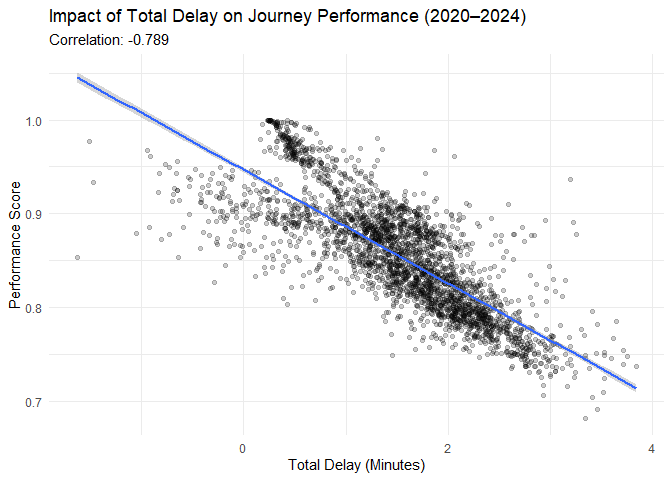

NYC Subway Customer Journey: Exploratory Data Analysis (2020–2024)
================
Subhechha Khatri
2025-12-25

# Project Overview

This project presents an exploratory data analysis (EDA) of **MTA Subway
Customer Journey metrics** from **2020 to 2024**. The objective is to
understand trends in ridership, journey time performance, delays, and
operational differences across **time periods (Peak vs. Off-Peak)** and
**divisions (A vs. B)**.

The analysis combines **data cleaning, visualization, and statistical
inference** to highlight system-wide recovery patterns post-COVID-19 and
identify key drivers of subway performance.

**Tools used:** `tidyverse` (`dplyr`, `ggplot2`)

------------------------------------------------------------------------

# Load and Prepare Data

``` r
library(tidyverse)

subway_data <- read.csv("MTA_Subway_Customer_Journey-Focused_Metrics__2020-2024.csv")
```

## Data Inspection

### Dataset Structure

``` r
str(subway_data)
```

    ## 'data.frame':    2856 obs. of  12 variables:
    ##  $ month                            : chr  "2020-01-01" "2020-01-01" "2020-01-01" "2020-01-01" ...
    ##  $ division                         : chr  "A DIVISION" "A DIVISION" "A DIVISION" "A DIVISION" ...
    ##  $ line                             : chr  "1" "1" "2" "2" ...
    ##  $ period                           : chr  "offpeak" "peak" "offpeak" "peak" ...
    ##  $ num_passengers                   : num  7175651 7976982 4897339 5525236 3501266 ...
    ##  $ additional.platform.time         : num  1.88 1.61 1.81 1.54 1.55 ...
    ##  $ additional.train.time            : num  0.762 0.69 0.275 0.198 0.289 ...
    ##  $ total_apt                        : num  13498506 12859167 8865514 8490208 5418246 ...
    ##  $ total_att                        : num  5470125 5505023 1345319 1093556 1011241 ...
    ##  $ over_five_mins                   : num  876067 901543 767125 701104 403844 ...
    ##  $ over_five_mins_perc              : num  0.122 0.113 0.157 0.127 0.115 ...
    ##  $ customer.journey.time.performance: num  0.878 0.887 0.843 0.873 0.885 ...

### Missing Values

``` r
sum(is.na(subway_data))
```

    ## [1] 0

### Summary Statistics

``` r
summary(subway_data)
```

    ##     month             division             line              period         
    ##  Length:2856        Length:2856        Length:2856        Length:2856       
    ##  Class :character   Class :character   Class :character   Class :character  
    ##  Mode  :character   Mode  :character   Mode  :character   Mode  :character  
    ##                                                                             
    ##                                                                             
    ##                                                                             
    ##  num_passengers    additional.platform.time additional.train.time
    ##  Min.   :   3017   Min.   :-0.4315          Min.   :-2.21369     
    ##  1st Qu.:1091265   1st Qu.: 0.9629          1st Qu.: 0.02419     
    ##  Median :2049147   Median : 1.2236          Median : 0.33926     
    ##  Mean   :2188061   Mean   : 1.2515          Mean   : 0.27682     
    ##  3rd Qu.:3184311   3rd Qu.: 1.5406          3rd Qu.: 0.59839     
    ##  Max.   :8923406   Max.   : 3.5069          Max.   : 1.58478     
    ##    total_apt          total_att        over_five_mins      over_five_mins_perc
    ##  Min.   :   -7396   Min.   :-3060992   Min.   :     46.3   Min.   :0.0001121  
    ##  1st Qu.: 1284948   1st Qu.:    5169   1st Qu.: 145187.0   1st Qu.:0.1072742  
    ##  Median : 2804886   Median :  626384   Median : 310382.7   Median :0.1466943  
    ##  Mean   : 2903727   Mean   :  933999   Mean   : 340477.6   Mean   :0.1457855  
    ##  3rd Qu.: 4261219   3rd Qu.: 1605923   3rd Qu.: 512973.9   3rd Qu.:0.1918574  
    ##  Max.   :14626464   Max.   : 7841808   Max.   :1274929.1   Max.   :0.3179524  
    ##  customer.journey.time.performance
    ##  Min.   :0.6820                   
    ##  1st Qu.:0.8081                   
    ##  Median :0.8533                   
    ##  Mean   :0.8542                   
    ##  3rd Qu.:0.8927                   
    ##  Max.   :0.9999

*Initial inspection confirms a clean, well-structured dataset with
performance and delay metrics suitable for trend analysis and
comparison.*

## Data Cleaning and Transformation

``` r
df <- subway_data %>%
  mutate(month = as.Date(month)) %>%
  rename(perf_score = customer.journey.time.performance)

head(df)
```

    ##        month   division line  period num_passengers additional.platform.time
    ## 1 2020-01-01 A DIVISION    1 offpeak        7175651                 1.881154
    ## 2 2020-01-01 A DIVISION    1    peak        7976982                 1.612034
    ## 3 2020-01-01 A DIVISION    2 offpeak        4897339                 1.810272
    ## 4 2020-01-01 A DIVISION    2    peak        5525236                 1.536624
    ## 5 2020-01-01 A DIVISION    3 offpeak        3501266                 1.547511
    ## 6 2020-01-01 A DIVISION    3    peak        4155656                 1.356647
    ##   additional.train.time total_apt total_att over_five_mins over_five_mins_perc
    ## 1            0.76231754  13498506 5470124.5       876067.4           0.1220889
    ## 2            0.69011340  12859167 5505022.5       901543.3           0.1130181
    ## 3            0.27470420   8865514 1345319.4       767125.2           0.1566412
    ## 4            0.19792019   8490208 1093555.8       701104.0           0.1268912
    ## 5            0.28882158   5418246 1011241.1       403843.7           0.1153422
    ## 6            0.08404413   5637757  349258.5       426559.4           0.1026455
    ##   perf_score
    ## 1  0.8779111
    ## 2  0.8869819
    ## 3  0.8433588
    ## 4  0.8731087
    ## 5  0.8846578
    ## 6  0.8973545

------------------------------------------------------------------------

# Exploratory Trend Analysis

## Monthly Ridership Trends (2020–2024)

``` r
df %>%
  group_by(month) %>%
  summarise(total_passengers = sum(num_passengers, na.rm = TRUE)) %>%
  ggplot(aes(x = month, y = total_passengers)) +
  geom_line(linewidth = 1) +
   scale_y_continuous(labels = scales::label_number(scale = 1e-6, suffix = "M")) +
  labs(
    title = "Monthly NYC Subway Ridership (2020–2024)",
    x = "Year",
    y = "Total Passengers"
  ) +
  theme_minimal()
```

<!-- -->

**Interpretation:** Ridership declined sharply in early 2020 due to the
COVID-19 pandemic. From 2021 through 2024, the data shows a resilient,
consistent upward trend, reflecting the gradual return to in-person
activities across New York City.

------------------------------------------------------------------------

## Lowest Performing Lines (2020–2024)

``` r
df %>%
  group_by(line) %>%
  summarise(mean_performance = mean(perf_score, na.rm = TRUE)) %>%
  arrange(mean_performance) %>%
  slice(1:5) %>%
  ggplot(aes(x = reorder(line, mean_performance), y = mean_performance)) +
  geom_col() +
  labs(
    title = "Bottom 5 Subway Lines by Average Performance",
    x = "Subway Line",
    y = "Mean Performance Score"
  ) +
  theme_minimal()
```

<!-- -->

**Interpretation:** These lines consistently perform below the system
average and may benefit from focused operational review, especially
during high-demand periods.

------------------------------------------------------------------------

# Statistical Inference

## Delay Construction and Summary Statistics

``` r
df_analysis <- df %>%
  mutate(total_delay = additional.platform.time + additional.train.time)

# Summary by division
df_analysis %>%
  group_by(division) %>%
  summarise(
    Avg_Performance = mean(perf_score, na.rm = TRUE),
    Avg_Delay = mean(total_delay, na.rm = TRUE),
    Total_Passengers = sum(num_passengers, na.rm = TRUE)
  )
```

    ## # A tibble: 2 × 4
    ##   division   Avg_Performance Avg_Delay Total_Passengers
    ##   <chr>                <dbl>     <dbl>            <dbl>
    ## 1 A DIVISION           0.890      1.28      2583101041.
    ## 2 B DIVISION           0.837      1.65      3666002146.

------------------------------------------------------------------------

## Hypothesis Testing (T-Tests)

### A. Peak vs. Off-Peak Performance

**H0 (Null Hypothesis):** Mean performance is equal across Peak and
Off-Peak periods.  
**H1 (Alternative Hypothesis):** Mean performance differs between Peak
and Off-Peak periods.

``` r
t.test(perf_score ~ period, data = df_analysis, conf.level = 0.95)
```

    ## 
    ##  Welch Two Sample t-test
    ## 
    ## data:  perf_score by period
    ## t = -10.565, df = 2848.2, p-value < 2.2e-16
    ## alternative hypothesis: true difference in means between group offpeak and group peak is not equal to 0
    ## 95 percent confidence interval:
    ##  -0.02752554 -0.01890765
    ## sample estimates:
    ## mean in group offpeak    mean in group peak 
    ##             0.8426062             0.8658228

**Interpretation:** At 95% confidence, the p-value is below 0.05, so we
reject the null hypothesis. Time of day has a statistically significant
effect on subway journey performance.

------------------------------------------------------------------------

### B. Division A vs. Division B Performance

**H0 (Null Hypothesis):** Mean performance is equal across divisions.  
**H1 (Alternative Hypothesis):** Mean performance differs between
Division A and Division B.

``` r
t.test(perf_score ~ division, data = df_analysis, conf.level = 0.95)
```

    ## 
    ##  Welch Two Sample t-test
    ## 
    ## data:  perf_score by division
    ## t = 28.306, df = 2654.7, p-value < 2.2e-16
    ## alternative hypothesis: true difference in means between group A DIVISION and group B DIVISION is not equal to 0
    ## 95 percent confidence interval:
    ##  0.04958302 0.05696385
    ## sample estimates:
    ## mean in group A DIVISION mean in group B DIVISION 
    ##                0.8898420                0.8365686

**Interpretation:** At 95% confidence level, the p-value is below 0.05,
so we reject the null hypothesis. The results indicate a statistically
significant difference between mean performance between the two
divisions.

------------------------------------------------------------------------

# Correlation and Regression Analysis

## Relationship Between Delays and Performance

### Correlation

``` r
cor_val <- cor(df_analysis$total_delay, df_analysis$perf_score)
cor_val
```

    ## [1] -0.7892036

A strong negative correlation shows that higher total delays are closely
associated with lower journey performance scores.

------------------------------------------------------------------------

### Linear Regression Model

Given the earlier finding, a regression model is used to quantify how
delays relate to journey performance.

``` r
perf_model <- lm(perf_score ~ total_delay, data = df_analysis)
summary(perf_model)
```

    ## 
    ## Call:
    ## lm(formula = perf_score ~ total_delay, data = df_analysis)
    ## 
    ## Residuals:
    ##       Min        1Q    Median        3Q       Max 
    ## -0.192424 -0.024993 -0.004476  0.025077  0.182982 
    ## 
    ## Coefficients:
    ##               Estimate Std. Error t value Pr(>|t|)    
    ## (Intercept)  0.9467452  0.0015132  625.66   <2e-16 ***
    ## total_delay -0.0605432  0.0008819  -68.65   <2e-16 ***
    ## ---
    ## Signif. codes:  0 '***' 0.001 '**' 0.01 '*' 0.05 '.' 0.1 ' ' 1
    ## 
    ## Residual standard error: 0.03676 on 2854 degrees of freedom
    ## Multiple R-squared:  0.6228, Adjusted R-squared:  0.6227 
    ## F-statistic:  4713 on 1 and 2854 DF,  p-value: < 2.2e-16

**Interpretation:** The model shows that total delay is a strong
predictor of journey performance. The high R-squared value indicates
that delays explain a large share of the variation in performance.

The Regression Equation
$$\text{Performance Score} = 0.9467 - 0.0605 \times (\text{Total Delay})$$

------------------------------------------------------------------------

### Visualization: Delay vs. Performance

``` r
ggplot(df_analysis, aes(x = total_delay, y = perf_score)) +
  geom_point(alpha = 0.2) +
  geom_smooth(method = "lm") +
  labs(
    title = "Impact of Total Delay on Journey Performance (2020–2024)",
    subtitle = paste("Correlation:", round(cor_val, 3)),
    x = "Total Delay (Minutes)",
    y = "Performance Score"
  ) +
  theme_minimal()
```

    ## `geom_smooth()` using formula = 'y ~ x'

<!-- -->

------------------------------------------------------------------------

# Key Takeaways

- NYC subway ridership shows a steady recovery following the 2020
  pandemic decline.
- Peak-hour travel is statistically less reliable than Off-Peak travel.
- Performance differences between divisions are statistically
  significant.
- Total delay is the main factor linked to lower journey performance.
