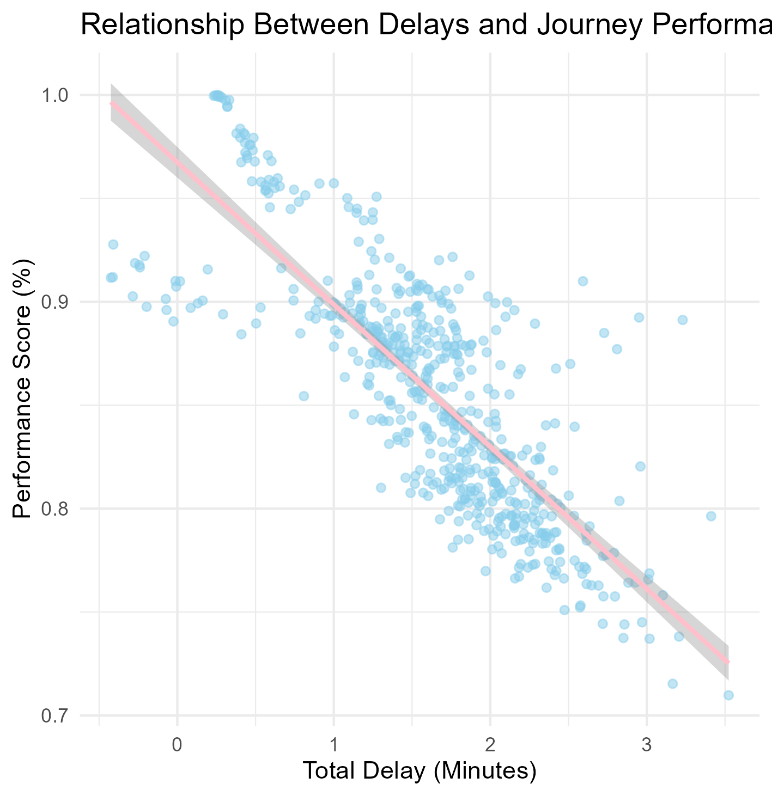

# NYC-Subway-Performance-EDA
An exploratory analysis of NYC Subway reliability leveraging MTA customer journey metrics. Utilizing R and statistical modeling, this study investigates the impact of peak-hour demand and platform/train delays on overall journey performance.

## Data Inspection & Quality
Before conducting the analysis, I performed a structural audit of the 2,856 records to ensure data integrity:
#### i. Missing Values
Confirmed 0 NA values across the entire dataset, ensuring that statistical calculations remain accurate.
#### ii. Anomalies
Identified negative delay values (representing "faster-than-scheduled" travel). These were retained to provide an accurate, unbiased system-wide average of performance.
#### iii. Scale
Monthly ridership peaked at nearly 9 million passengers, emphasizing the high stakes of maintaining service reliability in a high-traffic environment.

## Key Findings & Interpretations
### 1. The Impact of Peak Hours (T-Test)
#### Question: Does service reliability drop significantly during rush hour?
#### Result
A Two-Sample T-test confirmed a statistically significant difference (p < 0.05) between Peak and Off-Peak performance.
#### Interpretation
The system struggles to maintain scheduled performance during high-volume periods, likely due to increased platform congestion and longer dwell times.

### 2. Modeling the Cost of Delay (Linear Regression)

#### Model Formula: Performance = 0.967381 - 0.068734 * (Total Delay)

#### Slope Interpretation
For every one-minute increase in total delay, the performance score is predicted to drop by 6.87%.
#### Goodness of Fit
The R-squared value confirms that these delays explain most of the fluctuations in performance, validating the model's accuracy.

### 3. Visual Density & Distribution
I utilized an alpha transparency of 0.5 for the scatterplot to balance the visibility of individual outliers with the overall density of the dataset. This allows the viewer to see the primary cluster of performance (80-90%) while clearly identifying specific lines and months that fell into the lower 60-70% range.

## Business Recommendation
Based on the regression results, the MTA should focus on reducing "additional platform time." Since the model shows that fractional increases in wait times have a statistically measurable negative impact on performance scores, small improvements in platform dispatching could lead to significant gains in overall system reliability.
